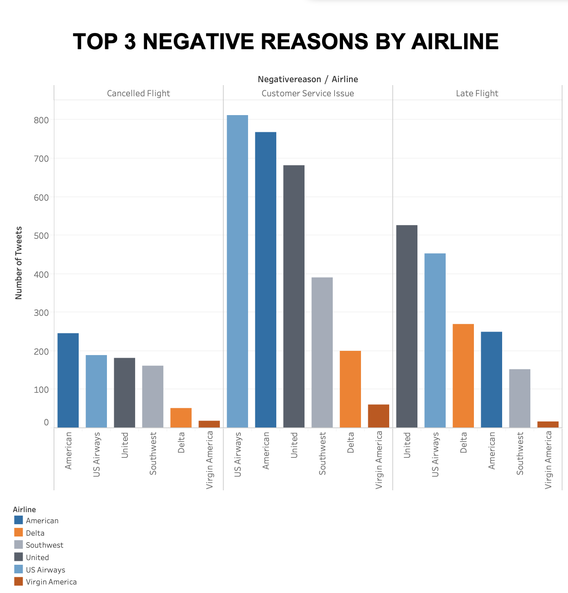
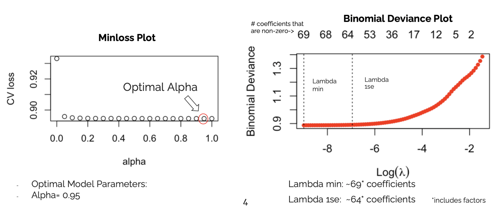
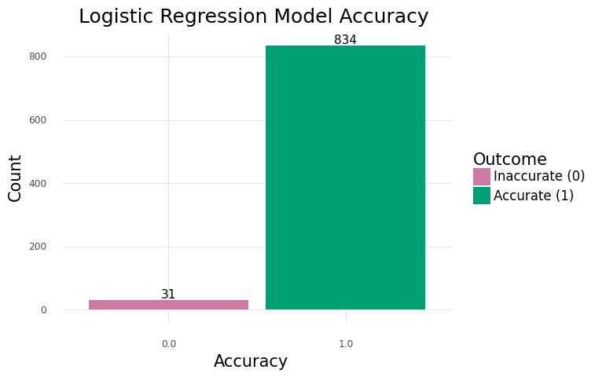
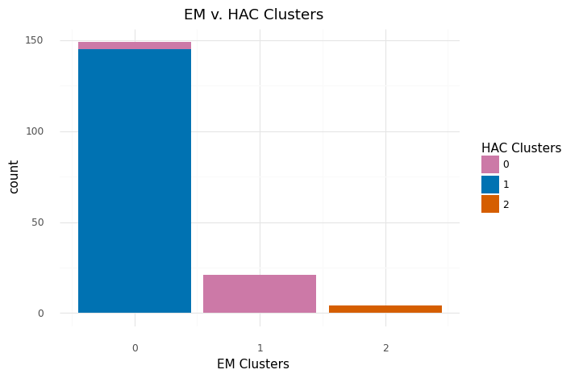
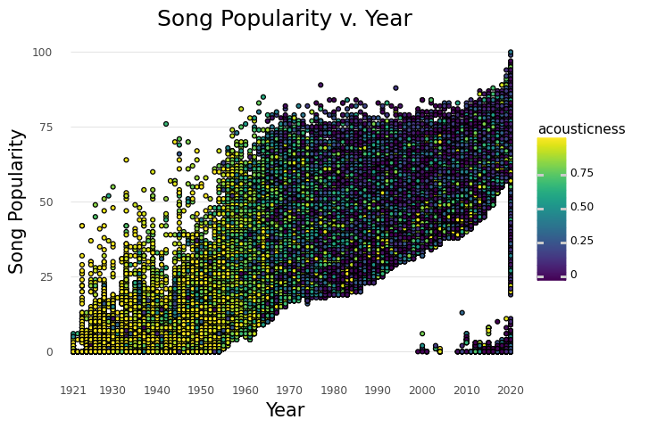

## My Work

---
### Data Exploration & Analysis
- [Airline Sentiment Analysis](https://github.com/kayla-cho/Airline-Sentiment/raw/main/Airline%20Sentiment%20Analysis.pdf)
  
    Created an executive summary of a Airline Sentiment data set found on Kaggle that contains data from February 2015 from six different airlines.

---

### Supervised Learning (Regression Models/ Decision Trees)

- [Diabetes Project](https://github.com/kayla-cho/Diabetes-Project/blob/bf73000b8e218cf5aac442b3a25568762356a535/Project1.ipynb)
  
  Developed a linear regression model to predict the BMI of a patient based on a set of predictor variables. Used variables like BMI to create a logistic regression model to determine if a patient has diabetes. 
  

---

- [Hotel Cancellations](https://github.com/kayla-cho/hotel-cancellations/blob/49feb3cca2e5d88761282868d7006e0e82eb40c4/Hotels%20%20Presentation.pdf)

  View Code [Here](https://github.com/kayla-cho/hotel-cancellations/blob/3ec6950bca746a22f4e206df6fc8d1fa6edee2c0/Final.nb.html)
  
  Collaborated with a team to explore a hotel data set found on Kaggle and create various models to predict hotel cancellations.  

---

- [Burgers or Pizza](https://github.com/kayla-cho/burgers-or-pizza/blob/8a59e914ba12b4e209a5d2396b17bbb9617c8d59/Burgers%20or%20Pizza%20Project.ipynb)
  
  Created a logistic regression model and decision tree to predict if the item is pizza or burger based on the items nutrition facts. 

---

### Unsupervised Learning (Clustering Models) 
- [Krispy Kreme Project](https://github.com/kayla-cho/krispy-kreme/blob/89cafe14d45d22f4b63489d803023ade2caf57f7/Krispy%20Kreme%20Project.ipynb)
  
  Created three different clustering models to group Krispy Kreme products by various variables.
  

---

### Combination of Supervised & Unsupervised Learning
  
- [Spotify Analysis](https://github.com/kayla-cho/spotify/blob/a8e4bddf1f6a82b527eb4cdcacd4d14832a89bb6/Final_Project.ipynb)
  
  Worked in a team of three to explore and analyze a Spotify data set using various regression and clustering models. 
  

